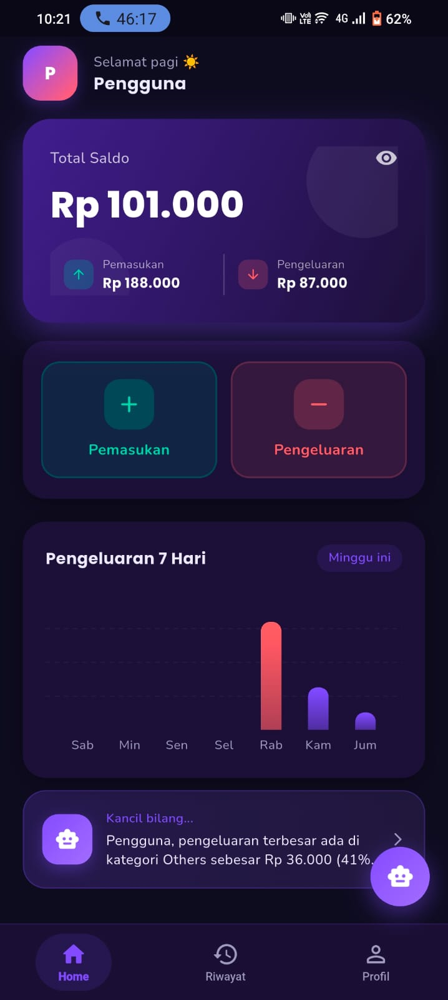
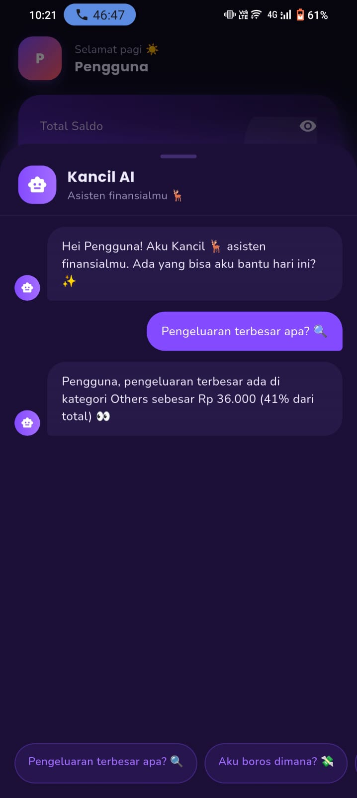
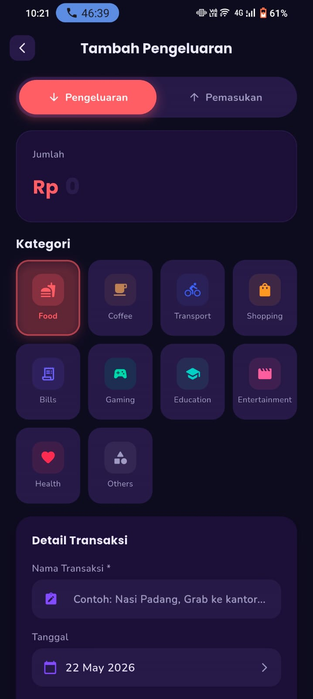
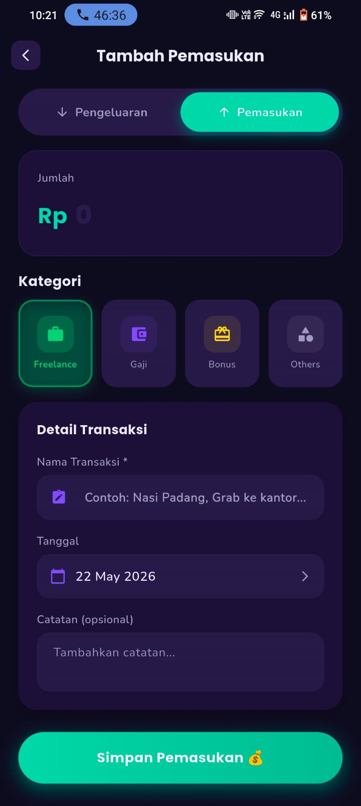
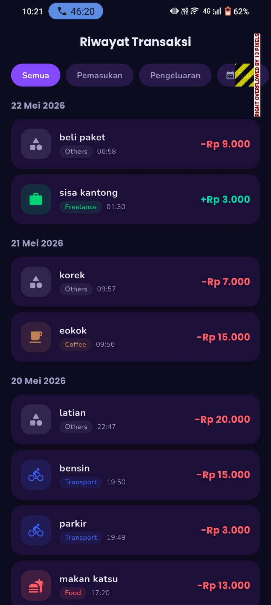
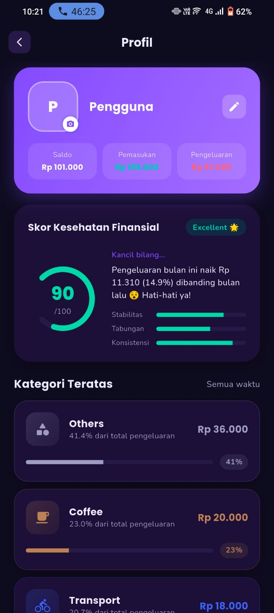

<div align="center">

# 💜 Simomon

### Smart Finance Tracker with Kancil AI 🦌

A modern personal finance application built with Flutter and SQLite.

[]()
[]()
[]()
[]()

Kelola keuangan dengan lebih cerdas menggunakan **Kancil AI 🦌** yang siap membantu menganalisis kondisi finansial Anda.

</div>

---

# 📱 Tentang Simomon

**Simomon** adalah aplikasi pencatat keuangan modern dengan desain Dark Neon UI yang membantu pengguna mengelola pemasukan dan pengeluaran secara mudah dan intuitif.

Aplikasi ini dilengkapi dengan **Kancil AI**, asisten finansial yang dapat memberikan insight mengenai pola pengeluaran dan kesehatan finansial pengguna.

---

# ✨ Fitur Utama

## 🏠 Dashboard

- Total saldo pengguna
- Informasi pemasukan dan pengeluaran
- Grafik pengeluaran 7 hari terakhir
- Shortcut tambah pemasukan dan pengeluaran
- Desain modern dark mode

---

## 🤖 Kancil AI Assistant

Kancil AI dapat membantu pengguna mengetahui:

- 🔍 Pengeluaran terbesar
- 📈 Analisis kesehatan finansial
- 💸 Kategori paling boros
- ⚠️ Peringatan ketika pengeluaran meningkat
- ✨ Insight kebiasaan finansial

Contoh:

```txt
Pengeluaran terbesar ada di kategori Others
sebesar Rp36.000 (41% dari total pengeluaran)
```

---

## 💰 Pemasukan

Kategori yang tersedia:

- Freelance 💼
- Gaji 💳
- Bonus 🎁
- Others 📦

Fitur:

- Input nominal
- Nama transaksi
- Tanggal transaksi
- Catatan tambahan

---

## 💸 Pengeluaran

Kategori yang tersedia:

- 🍔 Food
- ☕ Coffee
- 🚲 Transport
- 🛍 Shopping
- 📄 Bills
- 🎮 Gaming
- 🎓 Education
- 🎬 Entertainment
- ❤️ Health
- 📦 Others

---

## 📜 Riwayat Transaksi

Filter:

- Semua
- Pemasukan
- Pengeluaran

Informasi yang ditampilkan:

- Nama transaksi
- Kategori
- Jam transaksi
- Nominal transaksi
- Tanggal transaksi

---

## 👤 Profil Pengguna

Menampilkan:

- Total saldo
- Total pemasukan
- Total pengeluaran
- Skor kesehatan finansial
- Kategori pengeluaran terbesar

---

## 📊 Skor Kesehatan Finansial

Parameter penilaian:

- Stabilitas keuangan
- Konsistensi pemasukan
- Kemampuan menabung

Contoh:

```txt
Score : 90 / 100
Status : Excellent 🌟
```

---

# 📸 Screenshot

## Home Page

```md
assets/screenshots/home.jpg
```



---

## Kancil AI

```md
assets/screenshots/kancil_ai.jpg
```



---

## Tambah Pengeluaran

```md
assets/screenshots/expense.jpg
```



---

## Tambah Pemasukan

```md
assets/screenshots/income.jpg
```



---

## Riwayat Transaksi

```md
assets/screenshots/history.jpg
```



---

## Profil

```md
assets/screenshots/profile.jpg
```



---

# 🗄 Database

Menggunakan SQLite untuk menyimpan:

- User
- Pemasukan
- Pengeluaran
- Kategori
- Riwayat transaksi
- Statistik keuangan
- Skor kesehatan finansial

---

# 🛠 Tech Stack

| Teknologi | Fungsi |
|------------|--------|
| Flutter | Framework |
| Dart | Bahasa Pemrograman |
| SQLite | Database Lokal |
| Provider / GetX | State Management |
| fl_chart | Grafik |
| Shared Preferences | Penyimpanan konfigurasi |
| intl | Format tanggal |
| google_fonts | Font |
| flutter_animate | Animasi |

---

# 🎨 UI Design

Menggunakan konsep:

- 🌙 Dark Mode
- ✨ Neon Glow
- 💜 Glassmorphism
- 🟣 Rounded Corner
- 🎨 Material 3

Warna utama:

- Purple Neon (#8B5CF6)
- Cyan Neon (#14F1D9)
- Coral Pink (#FF5A7D)
- Background Dark (#090116)

---

# 📂 Project Structure

```text
lib/
│
├── main.dart
│
├── screens/
│     ├── home_page.dart
│     ├── income_page.dart
│     ├── expense_page.dart
│     ├── history_page.dart
│     ├── profile_page.dart
│     └── ai_chat_page.dart
│
├── models/
│     ├── transaction_model.dart
│     ├── category_model.dart
│     └── user_model.dart
│
├── database/
│     └── database_helper.dart
│
├── providers/
│     └── transaction_provider.dart
│
├── services/
│     ├── ai_service.dart
│     └── finance_service.dart
│
├── widgets/
│     ├── chart_widget.dart
│     ├── history_tile.dart
│     ├── category_card.dart
│     └── ai_message_card.dart
│
└── theme/
      └── app_theme.dart
```

---

# 📋 Requirements

- Flutter SDK 3.0+
- Android Studio
- VS Code
- Emulator Android atau perangkat fisik

---

# 🚀 Installation

Clone repository:

```bash
git clone https://github.com/username/simomon.git
```

Masuk ke folder project:

```bash
cd simomon
```

Install dependency:

```bash
flutter pub get
```

Jalankan aplikasi:

```bash
flutter run
```

---

# 🔮 Future Features

- ☁ Firebase Sync
- 🔐 Login & Register
- 📊 Grafik Bulanan
- 📥 Export PDF
- 📈 Export Excel
- 🌍 Multi Language
- 🔔 Reminder Tagihan
- 🤖 AI Recommendation
- 📉 Prediksi Pengeluaran

---

# 🤝 Contributing

1. Fork repository

2. Create new branch

```bash
git checkout -b new-feature
```

3. Commit changes

```bash
git commit -m "Add new feature"
```

4. Push

```bash
git push origin new-feature
```

5. Open Pull Request

---

# 📄 License

This project is licensed under the MIT License.

---

<div align="center">

# 🦌 Simomon

### Smart Finance Tracker with Kancil AI

Built with ❤️ using Flutter

### © 2026 Simomon

</div>


